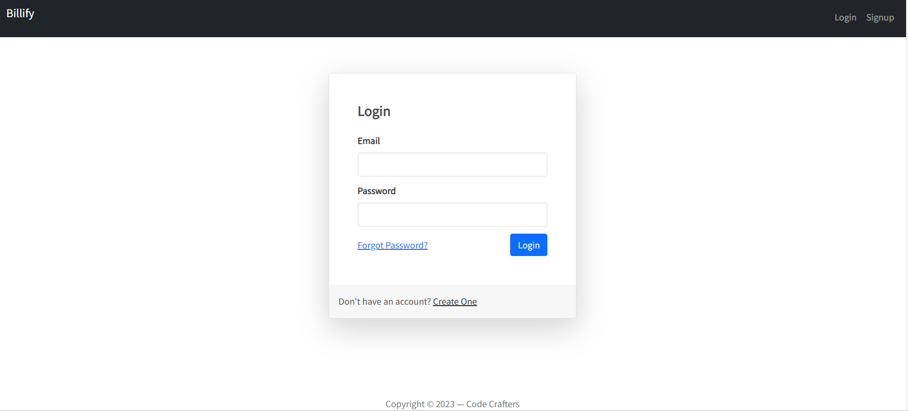

# The Django Invoice Project

The Django Invoice Project is a web application designed for the seamless generation of invoices and quotations. It's powered by Django and tailored for efficiency, empowering users to effortlessly create, manage, and track financial documents. The project provides a clean and user-friendly interface where users can input client details, services, and pricing to generate professional invoices and quotations.

## Installation
### Pre-requisites
* Docker
* Docker-Compose

To run the Django Invoice Project on your local environment, follow these steps:

1. Clone the repository to your local machine:

    ```
   git clone https://github.com/ntungufhadzeni/invoice-project.git
   ```
2. Navigate to the project directory:
   ```
   cd invoice-project
   ```
   
3. Create .env.dev file and paste this:

   ```
   # .env.dev
   SECRET_KEY=django-insecure-q#(2#8744e7j0o44%f9c)p&qf)640)g6&i+z&1d=at7a!8&a6!#w
   DEBUG=1
   SQL_ENGINE=django.db.backends.postgresql
   SQL_DATABASE=postgres
   SQL_USER=postgres
   SQL_PASSWORD=postgres
   SQL_HOST=db
   SQL_PORT=5432
   DJANGO_ALLOWED_HOSTS=localhost 127.0.0.1 [::1]
   ```
4. Build and start docker containers:
   ```
   docker-compose -f docker-compose.dev.yml up --build
    ```
5. Access the project in your web browser at `http://127.0.0.1/`.

## Screenshots




## Usage

- Navigate to the project URL, create account and log in with your credentials.
- Use the user-friendly interface to create company, input client details, services, and pricing to generate invoices and quotations.
- Manage and track your financial documents effortlessly.

## Contributing

Contributions to this project are welcome! Feel free to open issues, suggest enhancements, or submit pull requests.

## License

This project is licensed under the [MIT License](#).   
   